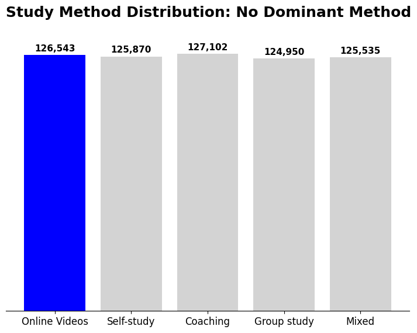
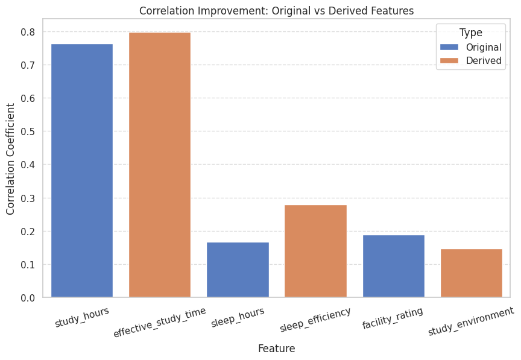
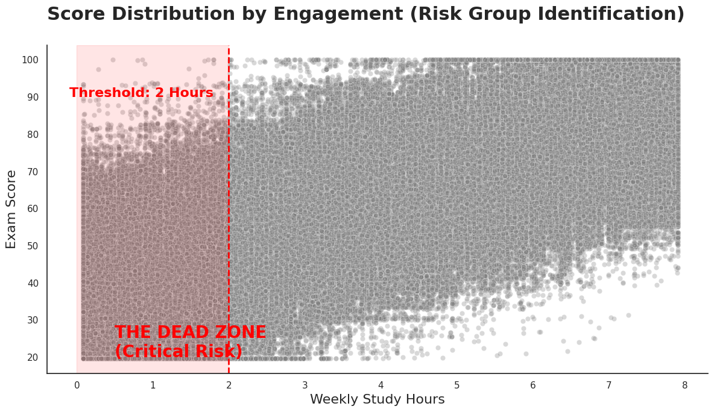

# kaggle_mini_project2

  
  

# 📚 인터넷 강의 플랫폼 관점 데이터 기반 성적 예측 및 플랫폼 개입 전략 도출
- 본 프로젝트는 대규모 학생 데이터를 활용하여 **학생의 성적을 예측하고 인터넷 강의 플랫폼의 비즈니스 성과를 극대화**할 수 있는지 분석하는 것을 목표로 한다. 가상의 온라인 교육 플랫폼 기업 소속이라는 가정 하에 분석을 진행함.

본 프로젝트는 단순한 성적 예측을 넘어, 플랫폼이 언제·어디에 개입해야 하는지를 데이터로 설명하는 것을 목표로 한다.

---

## TL;DR (요약)
- 목표: 시험 이전에 확보 가능한 학생 정보로 성적을 예측하고, **플랫폼이 실제로 개입할 지점**을 도출
- 핵심 인사이트: 콘텐츠 추천 이전에 **학습 참여 급락(‘Dead Zone’) 집단**을 조기에 식별·관리하는 것이 선행 과제
- 일반화 성능: Kaggle Public 기준 RMSE 약 **9.22(해석 모델)** → **8.92(AutoML)**

---

## 1) 데이터셋
- 출처: Kaggle Playground Series S6E1  
- 링크: https://www.kaggle.com/competitions/playground-series-s6e1
- 규모: train 약 **63만 건** (시험 점수 0~100)

---

## 2) 문제 정의 (플랫폼 관점)
시험 이전에 이미 확보 가능한 학습/행동 정보를 활용하면,
- 개인화 추천
- 학습 코칭/리마인드
- 이탈 방지
- 성과(성적) 개선  
과 같은 **서비스 개입**이 가능하다.

**핵심 질문**
1) 시험 이전 정보만으로 성적을 의미 있게 예측할 수 있는가?  
2) 학습 방식 중 **온라인 영상(online videos)**은 동일 학습 시간 대비 구별되는 성과 패턴을 보이는가?  
3) 콘텐츠 추천보다 우선해야 할 **개입 우선순위**는 무엇인가?

---

## 3) 접근 방법 (분석 프레임워크)
본 프로젝트는 예측 성능뿐 아니라 **해석 가능성과 실행 가능성**을 함께 확보하기 위해 아래 흐름으로 진행했다.

1) **EDA**: 변수의 타입·분포·관계를 점검하여, 시험 이전 정보만으로 성적 분석이 가능한 구조인지 확인  
2) **파생 지표 설계**: 단일 변수 대신 학습 흐름·컨디션·환경을 함께 반영하는 의미 기반 지표 구성
3) **검증**: 대규모 표본의 특성을 고려하여 p-value에만 의존하지 않고 **효과크기(effect size)**를 기준으로 실질적인 영향력 판단
4) **모델링**: 해석 모델(OLS) → 예측 최적화(AutoML)로 일반화 성능 확인

> 참고: 표본이 매우 크기 때문에 통계적 유의성(p-value)만으로 결론을 내리기보다, **효과크기(effect size)** 중심으로 “실질적으로 의미 있는 차이”를 판단했다.

### 학습 방식 분포 확인

학습 방식별 표본 수가 비교적 고르게 분포되어 있어, 특정 학습 방식에 대한 표본 편향 없이 성과 비교가 가능한 데이터 구조임을 확인했다.

---

## 4) 파생 지표 설계 (대표 변수)
단일 성과 지표(exam_score)에서 출발하되,  
**학습 흐름을 입체적으로 설명**하기 위해 아래 파생 지표를 설계했다.

- `effective_study_time = study_hours × class_attendance`  
  - “공부 시간”이 아니라 **실제로 참여한 학습량**을 반영
- `sleep_efficiency = sleep_hours × sleep_quality`  
  - 수면은 시간뿐 아니라 **질**이 함께 고려되어야 함
- `online_videos_index = study_hours × I(method = online videos)`  
  - 온라인 영상 학습의 **시간 대비 성과 패턴**을 직접 검증하기 위한 지표
- `low_engagement = (study_hours < Q1) & (class_attendance < Q1)`  
  - 콘텐츠 이전에 **행동 개입이 필요한 위험군(Dead Zone)** 식별 목적

(그 외 지표는 코드 참고)

### 파생 지표 유효성 검증

아래 그림은 원변수 대비 파생 지표가
시험 성적과의 선형 연관성을 어떻게 개선했는지를 보여준다.

- `effective_study_time`은 단순 학습 시간 대비
  성적과의 상관이 더 강화됨
- `sleep_efficiency` 역시 수면 시간을 단독으로 사용할 때보다
  설명력이 증가
- 이는 **의미 기반 파생 지표 설계가 타당했음을 정량적으로 뒷받침**한다

---

## 5) 핵심 결과 (Key Findings)

- **학습 방식은 성적에 실질적으로 영향을 준다** (효과크기 기준)
- **온라인 영상 학습은 최고 성과 방식은 아니지만, self-study 대비 일관되게 높은 성과**
- 학습 시간이 증가할수록 학습 방식에 따른 **성과 전환 기울기**가 달라지며,  
  online videos는 구별되는 패턴을 보임

- **Low Engagement(Dead Zone) 집단**은 평균 점수가 크게 낮아  
  **우선 개입 대상**으로 해석 가능

- 성별·전공 효과는 통계적으로는 유의하나  
  **효과크기 기준 실무적으로 무시 가능한 수준**

---

### 모델 관점에서의 최종 검증

아래 Feature Importance 결과는 본 프로젝트에서 설계한 파생 지표들이  
모델 예측에서도 실제로 중요한 변수로 작동했음을 보여준다.

---

## 6) 성능 요약 (Generalization Check)
- OLS(해석 중심) Kaggle RMSE ≈ **9.22**
- AutoGluon(예측 최적화) Kaggle RMSE ≈ **8.92**

> 목표는 리더보드 순위가 아니라, **보지 못한 데이터에서도 일관되게 작동하는지(일반화)**를 확인하는 것이다.

---

## 7) 실행 및 구성

본 프로젝트는 분석 과정과 결과 공유를 목적으로 하며, 전체 분석은 Jupyter Notebook(Colab) 환경에서 수행되었다. 

---

## Outputs

이 폴더는 분석 과정에서 생성된 주요 시각화 결과를 정리한 공간입니다.

- eda/: 데이터 분포 및 기본 구조 확인
- feature_engineering/: 파생변수 설계 효과 검증
- risk_analysis/: 저참여 위험군(Dead Zone) 식별
- modeling/: 모델 성능 비교 및 중요 변수 해석

각 이미지는 README.md 및 노트북에서 참조됩니다.

---

## 핵심 결과 요약

- 학습 방식은 성적에 실질적 영향을 미침
- 온라인 영상 학습은 시간 증가에 따라 효율이 빠르게 상승
- 학습 참여도가 낮은 집단은 별도의 개입이 필요함

📊 주요 시각화 결과는 outputs/figures/ 에 정리되어 있습니다.
